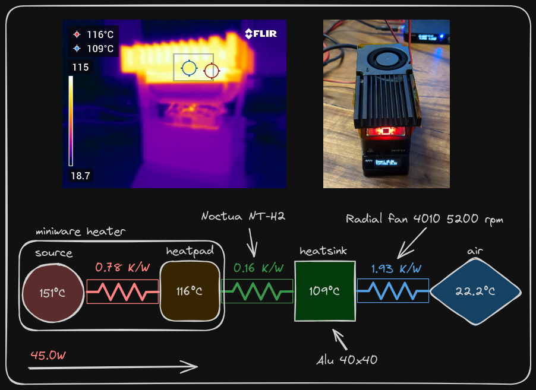

> ⚠️ Please note that the current repository is set up temporarily for the purpose of evaluation in the early phase of the crowdfunding campaign. 
> Once the evaluation phase concludes the entire project will be moved to a fork from the original STMBL repository as the final location.

# STMBL updates

As reported in the original github repository, [STMBL](https://github.com/rene-dev/stmbl) is an open-source servo drive designed for Retrofitting CNC machines and Robots. It supports Industrial AC and DC servos.

The original repository has not been maintained in the last 2 years and the latest release dates back to 2018.

One of the main downside of the orginal project was the access of phisical board, since you had to manufacture it by your self.
We want to address this problem and boost the further development of the board starting a croudfunding campaign.

With this repository we are proposing a fresh review of the project making significant improvements and updates:

- H-bridge
- Power connectors
- Bulk Capacitor
- Heat dissipation components and case
- Other obsolete components

  

## H-Bridge
First we needed to replace the original and obsolete H-bridge IRAM256 with a more powerful and easily available one.
We chose the [Infineon IKCM30F60GD](https://www.mouser.it/datasheet/2/196/Infineon_IKCM30F60GD_DataSheet_v02_05_EN-3361791.pdf) capable of peak output currents up to 60Amps instead of 30 of the original bridge.

## Upgrading Power connectors
During our tests with earlier prototypes we noticed that the original power connectors overheated and even got damaged when the board drove big loads.

 

So we decided to replace power connectors, both HV DC input and 3 Phase output with golden plated XT60PW and MR60PW connectors from Amass®, designed for high current up to 60Amps.

## Bulk Capacitor

We have relocated big bulk capacitors outside in a rectifier module as close as possible to the drives. 
Instead internally we kept a more compact MKP Polypropylene snubber capacitor for decoupling the bridge HV power supply.

 

## Heat dissipation components and case

We also optimized heat dissipation components and layout, reducing overall volume by half compared to the original design.

 
 

## Other obsolete components

there were several other components that have been replaced because they have become obsolete:

- ACT4088US-T (DC/DC converter) replaced with [RT8259GE](https://www.mouser.it/datasheet/2/1458/DS8259_03-3104661.pdf) from Richtek.
- Together with DC/Dc converters, the power inductors have also been updated to:
    - [ME3220-472MLC 4.7uH ](https://www.mouser.it/ProductDetail/994-ME3220-472MLC)
    - [ME3220-682MLC 6.8uH](https://www.mouser.it/ProductDetail/994-ME3220-682MLC)
    - [ME3220-103KLC 10uH](https://www.mouser.it/ProductDetail/994-ME3220-103KLC)
- ZLDO1117G33TA (LDO 3.3V 1A) replaced with its new version [LDL1117S33R](https://www.mouser.it/ProductDetail/511-LDL1117S33R) from STMicroelettronics
- both microUSB connectors have been updated to the more modern USBc
